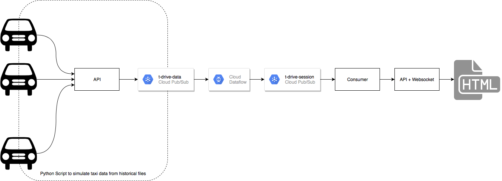

# Demo App

The demo app uses:
- a Google Dataflow pipeline which outputs sessions at minute intervals
- a python script that reads from a file and publishes message on Pubsub
- a python script that reads sessions from Pubsub and publishes them to a REST API
- a web service that publishes messages into a websocket and serves a static map

## Architecture

The whole architecture hinges around Google Dataflow, that is in charge of emitting sessions every one minute for each of the taxi in the dataset. The input of the Dataflow pipeline is Pubsub, as well as the output.

### Input

The input dataset will be the Microsoft T-Drive (one week of taxi location in Beijing), which can be downloaded for free.
In a real-world scenario, every taxis would be equipped with a tracker that sends data to an API. The API (after authorize/authenticate the tracker) would then forward the payload to a Pubsub queue.
In our dummy example, the input will be simulated by a simple Python script, publishing the payload directly into the Pubsub queue.

### Output

The aim is to display the data on a map in realtime over multiple client (ideally having them in sync), hence I decided to use a Websocket to build a continuous stream of data in the front-end: in this way, the webserver is not overloaded by multiple front-end performing polling, as Websockets are event-driven.

### Diagram

Final diagram of the demo is below:



## How to run?

### Assets

The required assets are:
- GCP project (set two environment variable, `GCP_PROJECT` and `GCP_REGION`)
- Two Pubsub topics: `t-drive-data` and `t-drive-session`)
- One Pubsub subscription for `t-drive-session`, called `t-drive-session-sub`
- One BigQuery table `t_drive_data.session_data` with 5 columns: `taxi_id, start_ts, end_ts, hex_addr, count`

An additional requirement is the creation of a service account and the download of the json file, as well as the setup of the `GOOGLE_APPLICATION_CREDENTIALS` environment variable.

### Input dataset and Pubsub producer

To download the dataset, follow the link to the [Microsoft T-Drive](https://www.microsoft.com/en-us/research/publication/t-drive-trajectory-data-sample/) page.

Once downloaded, the dataset needs to be merged into a single file with a couple of simple bash commands:

```bash
less input/*.txt | awk -F, '{print $2,$1,$3,$4}' OFS=, > output.txt
sort output.txt | awk -F, '{print $2,$1,$3,$4}' OFS=, > output.sorted.txt
```

where `input/` folder contains the original dataset. The final file is used as input of the Pubsub producer.

Once the input dataset is ready, you can run the producer with:

```bash
python pubsub/producer.py ../data/output.sorted.txt
```

### Dataflow Streaming Job

The streaming job can be launched with:

```bash
./scripts/run-stream.sh
```

### Run Webapp

The webapp can be launched with:

```bash
python app/main.py
```

Once running, you will be to see the map at: http://127.0.0.1:5000/

### Pubsub consumer

The consumer can be launched with:

```bash
python pubsub/consumer.py
```

The consumer will receive in-flight sessions 


